# FRA Portal - Forest Rights Administration Dashboard

A comprehensive platform for tracking, visualizing, and managing Forest Rights Act (FRA) claims across India. Built with modern web technologies to provide government officials and community leaders with powerful tools for forest rights administration.

## 🌟 Overview

The FRA Portal is a sophisticated web application designed to streamline forest rights management across India. It provides interactive mapping, real-time data visualization, and comprehensive administrative tools for managing Forest Rights Act claims at both government and local community levels.

## 🧭 Use Case Diagram

```mermaid
flowchart LR
    %% Actors
    A["👤 Local Community User\n(Claimant / Village Leader)"]
    G["👤 Government Official\n(Admin/Reviewer)"]
    N["👤 NGO / Department User\n(Restricted Access)"]

    %% Systems
    subgraph FRA Portal
      direction LR
      UC1((Register / Login))
      UC2((Select Role))
      UC3((View Map & Analytics))
      UC4((Submit/Track FRA Application))
      UC5((Upload & Manage Documents))
      UC6((Receive / Manage Alerts))
      UC7((Review & Verify Applications))
      UC8((Generate Reports))
      UC9((AI: Analyze Documents))
      UC10((AI: Validate Application))
      UC11((User Management))
    end

    %% Associations
    A --- UC1
    A --- UC2
    A --- UC3
    A --- UC4
    A --- UC5
    A --- UC6

    G --- UC1
    G --- UC2
    G --- UC3
    G --- UC6
    G --- UC7
    G --- UC8
    G --- UC11

    N --- UC1
    N --- UC2
    N --- UC3
    N --- UC6

    %% AI Services used by multiple cases
    UC5 -. uses .- UC9
    UC4 -. uses .- UC10
    UC7 -. uses .- UC9
```



## 🔄 User Flow Diagram

```mermaid
flowchart TD
    L[Landing Page] --> RS{Logged in?}
    RS -- No --> LG[Login / Sign Up]
    LG --> RL[Select Role]
    RS -- Yes --> RL

    RL -->|Government| GD[Government Dashboard]
    RL -->|Local Community| LD[Local Community Dashboard]
    RL -->|NGO/Dept| ND[Department Dashboard]

    %% Government flows
    GD --> GM[Map & Analytics]
    GD --> GA[Alerts Management]
    GD --> GR[Review Applications]
    GD --> GDoc[Verify Documents]
    GD --> GRep[Generate Reports]
    GR --> GAI[AI Validate Application]
    GDoc --> GAI2[AI Analyze Documents]

    %% Local flows
    LD --> LM[View Village Map]
    LD --> LA[Submit/Track Application]
    LD --> LDoc[Upload Documents]
    LD --> LAl[View Alerts]
    LDoc --> LAI[AI Analyze Documents]

    %% NGO flows
    ND --> NM[View Map (Restricted)]
    ND --> NAl[View Alerts]

    %% Global
    subgraph Global
      direction LR
      PR[Protected Routes]
      RBAC[Role-Based Access Control]
    end

    LG --> PR
    RL --> RBAC
    GD --> PR
    LD --> PR
    ND --> PR
```

## 🚀 Key Features

### 🗺️ Interactive Mapping
- Real-time visualization of forest rights claims across Indian states
- Detailed geographic data with Leaflet maps
- Focus on key states: Madhya Pradesh, Odisha, Telangana, and Tripura
- Village-level data with coordinates and forest coverage information

### 📊 Advanced Analytics
- Comprehensive data visualization with charts and graphs
- Statistical insights and trend analysis
- Real-time dashboard updates
- Customizable reporting tools

### 🔐 Secure Authentication
- Firebase-powered authentication system
- Role-based access control (Government vs Local users)
- Google OAuth integration
- Protected routes and session management

### 👥 User Management
- Complete user registration and login system
- Role selection (Government Official or Local Community Leader)
- Profile management and user preferences
- Secure data handling

### 📱 Mobile Responsive Design
- Seamless experience across desktop, tablet, and mobile devices
- Touch-friendly interface
- Optimized for field work and remote access

## 🛠️ Technology Stack

### Frontend Technologies
- **React 18** - Modern UI framework with hooks and functional components
- **TypeScript** - Type-safe development for better code quality
- **Vite** - Fast build tool and development server
- **Tailwind CSS** - Utility-first CSS framework for styling
- **shadcn/ui** - Beautiful, accessible component library

### UI Components & Libraries
- **Radix UI** - Headless UI components for accessibility
- **Lucide React** - Beautiful icon library
- **Framer Motion** - Smooth animations and transitions
- **React Hook Form** - Form handling with validation
- **Zod** - Schema validation

### Mapping & Visualization
- **Leaflet** - Interactive maps
- **React Leaflet** - React components for Leaflet
- **Recharts** - Data visualization and charts

### Backend & Authentication
- **Firebase** - Authentication, database, and hosting
- **Firebase Auth** - User authentication and authorization
- **Google OAuth** - Social login integration

### State Management & Data
- **TanStack Query** - Server state management
- **React Context** - Global state management
- **Custom Hooks** - Reusable stateful logic

### Development Tools
- **ESLint** - Code linting and quality
- **PostCSS** - CSS processing
- **Autoprefixer** - CSS vendor prefixing

## 📁 Project Structure

```
src/
├── components/           # Reusable UI components
│   ├── ui/              # shadcn/ui component library
│   ├── AlertManagement.tsx    # Alert management system
│   ├── AlertViewer.tsx        # Alert display component
│   ├── ControlPanel.tsx       # Dashboard control panel
│   ├── DetailsDrawer.tsx      # Village details sidebar
│   ├── ForestLayout.tsx       # Forest area layout
│   ├── Header.tsx             # Navigation header
│   ├── MapView.tsx            # Interactive map component
│   └── ProtectedRoute.tsx     # Route protection wrapper
├── contexts/            # React Context providers
│   └── AuthContext.tsx        # Authentication context
├── data/                # Mock data and types
│   ├── demoData.ts            # Demo data for development
│   └── mockData.ts            # Mock data structures
├── hooks/               # Custom React hooks
│   ├── use-mobile.tsx         # Mobile detection hook
│   └── use-toast.ts           # Toast notification hook
├── lib/                 # Utility libraries
│   ├── firebase.ts            # Firebase configuration
│   └── utils.ts               # Utility functions
├── pages/               # Page components
│   ├── GovernmentDashboard.tsx    # Government user dashboard
│   ├── LocalDashboard.tsx        # Local community dashboard
│   ├── Landing.tsx              # Landing page
│   ├── Login.tsx                # Login page
│   ├── SignUp.tsx               # Registration page
│   ├── RoleSelection.tsx        # Role selection page
│   ├── Index.tsx                # Main dashboard
│   └── NotFound.tsx             # 404 error page
├── App.tsx              # Main application component
├── main.tsx             # Application entry point
└── index.css            # Global styles and CSS variables
```

## 🎯 User Roles & Features

### Government Dashboard
- **Interactive Map View**: Visualize all forest rights claims across states
- **Analytics & Reports**: Comprehensive data analysis and reporting
- **Alert Management**: Create and manage alerts for communities
- **Village Management**: Edit and update village information
- **Complaint Resolution**: Handle and resolve community complaints
- **Forest Area Management**: Manage forest area data and boundaries

### Local Community Dashboard
- **Village-Specific View**: Focus on local village data and claims
- **Alert Viewer**: View government announcements and alerts
- **Complaint Submission**: Submit complaints and issues
- **Status Tracking**: Track claim status and progress
- **Forest Information**: Access local forest area information

## 🗺️ Geographic Coverage

The application focuses on four key Indian states with comprehensive forest rights data:

1. **Madhya Pradesh** - Central India's forest heartland
2. **Odisha** - Eastern coastal state with significant tribal populations
3. **Telangana** - Southern state with diverse forest ecosystems
4. **Tripura** - Northeastern state with rich biodiversity

## 🚀 Getting Started (Monorepo Overview)

### Prerequisites
- Node.js (v18 or higher)
- npm or yarn package manager
- Python 3.11+
- Firebase project setup (for auth)

### Installation

1. **Clone the repository**
   ```bash
   git clone <repository-url>
   cd fra-vista-dash-main
   ```

2. **Install frontend dependencies**
   ```bash
   cd FRA/frontend
   npm install
   ```

3. **Set up Firebase**
   - Create a Firebase project
   - Enable Authentication (Email/Password and Google)
   - Copy your Firebase config to `FRA/frontend/src/lib/firebase.ts`

4. **Start services in dev**
   - Backend (OCR):
     ```bash
     cd FRA/backend/ocr_service
     pip install -r requirements.txt
     set PORT=8000   # on Windows (or export PORT=8000 on Unix)
     python app.py
     ```
   - Frontend (Vite):
     ```bash
     cd FRA/frontend
     npm run dev
     ```

5. **Open your browser**
   - Frontend: `http://localhost:8080`
   - API docs: `http://localhost:8000/docs` (or via Nginx at `http://localhost/docs`)

### Build for Production (Frontend)

```bash
npm run build
# or
yarn build
```

## 🔧 Configuration

### Firebase Setup
1. Create a new Firebase project
2. Enable Authentication with Email/Password and Google providers
3. Update the Firebase configuration in `FRA/frontend/src/lib/firebase.ts`

### Environment Variables
Create a `.env` file in `FRA/frontend`:
```
VITE_FIREBASE_API_KEY=your_api_key
VITE_FIREBASE_AUTH_DOMAIN=your_project.firebaseapp.com
VITE_FIREBASE_PROJECT_ID=your_project_id
# OCR API (choose one)
VITE_OCR_API_URL=http://localhost:8000/ocr
# or via Nginx reverse proxy:
# VITE_OCR_API_URL=http://localhost/api/ocr
```

## 📊 Data Structure

### Village Data
- **ID**: Unique identifier
- **Name**: Village name
- **State/District**: Geographic location
- **Coordinates**: Latitude and longitude
- **FRA Type**: Individual Forest Rights (IFR) or Community Forest Rights (CFR)
- **Land Area**: Area in hectares
- **Status**: Approved, Pending, or Rejected
- **Population**: Village population
- **Forest Cover**: Percentage of forest coverage

### Alert System
- **Title & Message**: Alert content
- **Type**: Scheme, Announcement, Warning, or Update
- **Priority**: High, Medium, or Low
- **Target Audience**: All, Local, or Government users
- **Geographic Scope**: State, district, or village level

## 🎨 Design System

### Color Palette
- **Primary**: Forest green theme
- **Status Colors**: 
  - Approved: Green
  - Pending: Yellow/Orange
  - Rejected: Red
- **Dashboard**: Professional blue-gray theme

### Typography
- **Headings**: Bold, modern sans-serif
- **Body**: Clean, readable font
- **Code**: Monospace for technical content

### Components
- Built with shadcn/ui component library
- Fully accessible and keyboard navigable
- Consistent design language throughout

## 🔒 Security Features

- **Firebase Authentication**: Secure user authentication
- **Role-based Access Control**: Different permissions for different user types
- **Protected Routes**: Authentication required for sensitive pages
- **Data Validation**: Input validation and sanitization
- **HTTPS**: Secure data transmission

## 📱 Mobile Optimization

- **Responsive Design**: Works on all screen sizes
- **Touch-friendly**: Optimized for mobile interactions
- **Offline Capability**: Basic functionality without internet
- **Progressive Web App**: Installable on mobile devices

## 🚀 Deployment

### Netlify (Recommended)
1. Connect your GitHub repository
2. Set build command: `npm run build`
3. Set publish directory: `dist`
4. Configure environment variables

### Vercel
1. Import your project
2. Set framework preset to Vite
3. Configure build settings
4. Deploy

### Firebase Hosting
### Nginx Reverse Proxy (Optional)
If you want to proxy the backend through Nginx:
1. Go to `FRA/nginx`
2. Start with Docker Compose or the provided scripts
3. Frontend continues on port 8080, API proxied at `/api/*`
1. Install Firebase CLI
2. Run `firebase init hosting`
3. Build and deploy with `firebase deploy`

## 🤝 Contributing

1. Fork the repository
2. Create a feature branch
3. Make your changes
4. Add tests if applicable
5. Submit a pull request

## 📄 License

This project is built for Forest Rights Administration and is intended for government and community use.

## 📞 Support

For support and questions:
- Create an issue in the repository
- Contact the development team
- Check the documentation

## 🔮 Future Enhancements

- **Real-time Collaboration**: Multi-user editing capabilities
- **Advanced Analytics**: Machine learning insights
- **Mobile App**: Native mobile applications
- **API Integration**: Connect with government databases
- **Multi-language Support**: Regional language support
- **Offline Sync**: Full offline functionality

---

**Built with ❤️ for Forest Rights Administration in India**